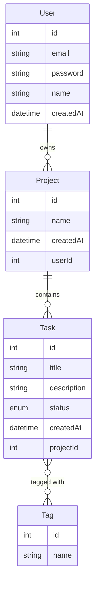

# Task Manager API


A REST API for managing tasks, projects and tags, built with Node.js, Express and Prisma. Features JWT authentication, per-user data isolation, pagination/filtering/sorting, and full test coverage.

**Live demo:** https://task-manager-api-5f08.onrender.com
**Interactive API docs:** https://task-manager-api-5f08.onrender.com/api-docs

> The demo API runs on a free-tier host with an ephemeral SQLite database — a conscious tradeoff for a portfolio project (see [Known limitations](#known-limitations)). Register a fresh account via `/auth/register` or Swagger's "Try it out" to explore it.

## Features

- **Authentication** — registration and login with bcrypt password hashing and JWT tokens.
- **Authorization** — every user only sees and manages their own projects and tasks (real multi-tenancy, not just write-protection); tags are a shared resource.
- **Full CRUD** for Users, Projects, Tasks and Tags, including a many-to-many Task↔Tag relationship.
- **Pagination, filtering and sorting** on task and project listings (`?page=&limit=&status=&sortBy=&order=`).
- **Input validation** with Zod on every write endpoint.
- **Centralized error handling** mapping Prisma error codes to correct HTTP responses (404 not found, 409 conflict, 400 bad request).
- **Security hardening** — Helmet security headers, rate limiting (with a stricter limit on auth routes).
- **Interactive API documentation** via Swagger/OpenAPI.
- **38 automated integration tests** (Vitest + Supertest) against an isolated test database, run automatically on every push via GitHub Actions.

## Tech stack

- **Runtime:** Node.js (native TypeScript type-stripping used to import the generated Prisma client)
- **Framework:** Express 5
- **Database:** SQLite via Prisma ORM 7 (driver adapters, `better-sqlite3`)
- **Auth:** JSON Web Tokens (`jsonwebtoken`) + `bcrypt`
- **Validation:** Zod
- **Testing:** Vitest + Supertest
- **Docs:** swagger-jsdoc + swagger-ui-express
- **CI:** GitHub Actions

## Data model



## Architecture

The codebase follows a layered structure:

```
src/
├── routes/        → defines endpoints and HTTP verbs, documented with Swagger JSDoc
├── controllers/    → parses/validates requests, calls services, shapes responses
├── services/       → business logic and Prisma queries
├── schemas/        → Zod validation schemas
├── middlewares/    → auth (JWT verification), centralized error handler
├── lib/            → Prisma client singleton
└── generated/      → auto-generated Prisma client (not committed)
```

A request flows `route → controller → service → database`, with authentication/authorization enforced by middleware and service-layer ownership checks.

## Getting started

### Prerequisites

- Node.js 23.6+ (native TypeScript support is required to import the generated Prisma client)

### Installation

```bash
git clone https://github.com/AngelRuiiz12/task-manager-api.git
cd task-manager-api
npm install
```

### Environment variables

Copy `.env.example` to `.env` and fill in a real `JWT_SECRET`:

| Variable       | Description                                  | Example                    |
| -------------- | --------------------------------------------- | --------------------------- |
| `PORT`         | Port the server listens on                    | `3000`                     |
| `DATABASE_URL` | SQLite connection string                      | `file:./prisma/dev.db`     |
| `JWT_SECRET`   | Secret used to sign JWTs — must be kept private | generate with the command below |

```bash
node -e "console.log(require('crypto').randomBytes(32).toString('hex'))"
```

### Database setup

```bash
npx prisma migrate dev
npx prisma db seed   # optional: creates a demo user + project
```

### Run

```bash
npm run dev     # development, with auto-reload
npm start       # production
```

The API will be available at `http://localhost:3000`, with interactive docs at `http://localhost:3000/api-docs`.

## Running tests

Tests run against an isolated SQLite database (`prisma/test.db`), reset before every test.

```bash
npx prisma migrate deploy   # first time only, with DATABASE_URL pointing at the test db (see .env.test)
npx vitest run
```

38 tests covering CRUD, validation, authentication, cross-user authorization boundaries, and pagination/filtering/sorting.

## API overview

| Resource | Endpoints |
| --- | --- |
| Auth | `POST /auth/register`, `POST /auth/login` |
| Tasks | `GET/POST /tasks`, `GET/PUT/DELETE /tasks/:id`, `POST /tasks/:id/tags`, `DELETE /tasks/:id/tags/:tagId` |
| Projects | `GET/POST /projects`, `GET/PUT/DELETE /projects/:id` |
| Users | `GET/PUT/DELETE /users/:id` (self only) |
| Tags | `GET/POST /tags`, `GET/PUT/DELETE /tags/:id` |

Full request/response schemas and a "try it out" console are available at [`/api-docs`](https://task-manager-api-5f08.onrender.com/api-docs).

## Known limitations

- **Ephemeral storage in production:** the deployed instance uses SQLite on Render's free tier, which does not guarantee persistent disk storage — data may reset on redeploys or after a period of inactivity. This is a deliberate tradeoff for a zero-cost portfolio demo; a production deployment would use a managed database (e.g. PostgreSQL).
- **Tags are a shared resource:** unlike Projects and Tasks, Tags are not scoped per user — this was a deliberate design choice, not an oversight.

## License

ISC
